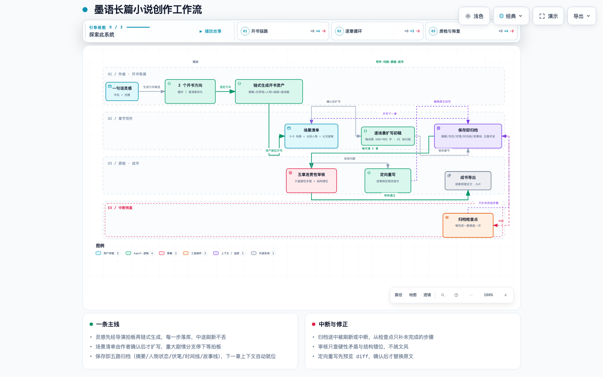
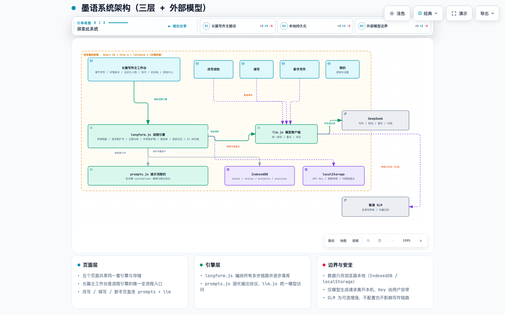
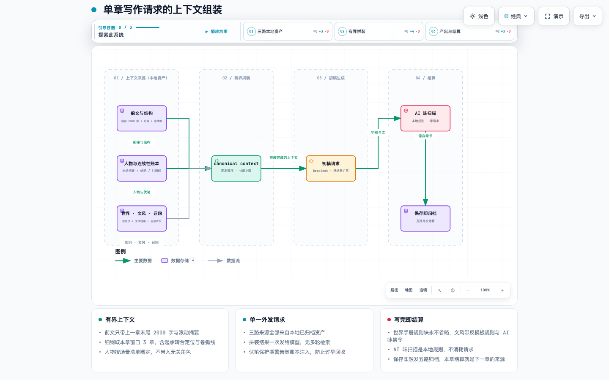

<p align="center">
  <strong>墨语 · 面向长篇小说的 AI 创作工作台</strong><br>
  <sub>从灵感、设定和大纲，一直写到审稿与成书</sub>
</p>

<p align="center">
  
  
  
  
</p>

<p align="center">
  <strong>长篇小说不是一次性 Prompt。</strong><br>
  墨语把梗概、人物与世界状态、滚动大纲、章节记忆、伏笔账本、写作、审稿和修订放进同一条可持续的创作流程。
</p>

---

## 墨语是什么

墨语专注一件事：**让一部长篇小说在几十章之后仍然写得下去，而且不轻易丢失设定和故事事实。**

它不是只负责生成下一段文字的聊天框，而是一套**纯前端、本地优先**的长篇创作系统：用户自带 DeepSeek 与智谱 GLM 的 API Key，全部作品数据存放在浏览器本地（IndexedDB），只有真正发送给所选模型的请求内容会离开本机。没有服务端、没有账号、没有云端锁定。

```text
灵感一句话
    ↓
开书导演：方向候选 → 梗概 → 世界观 → 人物班底 → 前10章细纲 → 第1卷战略
    ↓  可写资产就位
逐章写作：场景清单 → 逐场景扩写 → 保存即归档（摘要/状态/伏笔/时间线/故事线五路并发）
    ↓
质检与修订：五章连贯性审核 → 定向重写 → 全局诊断
    ↓
成书导出（TXT / Markdown，卷分隔）
```

| 适合这样的创作 | 它不承诺什么 |
|---|---|
| 正在写中长篇，需要长期维护人物、设定、伏笔和章节状态 | 输入一句话后无需作者参与就自动生成整本小说 |
| 希望自己掌握方向，让 AI 承担规划、初稿、归档与审查执行 | 让参考作品或模型判断绕过作者确认 |
| 看重本地数据、自带 Key、无服务端依赖 | 把你的正文长期锁在某个云端平台 |
| 想摆脱"AI 味"套路腔与照搬参考作品的风险 | 替你做剧情拍板——重大分支永远停下等你决定 |

---

## 工作流程总览

[](docs/diagrams/workflow.html)

> 交互版（支持节点聚焦 / 关系追踪 / 明暗主题）：[docs/diagrams/workflow.html](docs/diagrams/workflow.html)

**开书导演**：把一句话灵感先扩展成 3 个差异化方向（题材/基调不同）供作者拍板，选中后链式生成全套开书资产，每一步完成立即落库，中途刷新不丢。细纲章头自带**起/承/转/合/过渡**结构定位标签，写章、场景规划与审稿都会注入该定位；卷档案带起承转合结构（含章节范围）与情感走向。

**逐场景扩写**：写章前由 AI 规划 3~5 个场景清单（顺带圈定出场人物、涉及地点、重大分支提案），确认后每个场景单独成文（600~900 字），根治单次生成长文后段压缩的问题。自动连写模式可整本推进，遇到剧情重大分支会暂停等待作者拍板。

**保存即归档**：保存章节时五路并发结算——章节摘要、人物状态回写、伏笔账本（含保护期，禁止抢收）、时间线事件、故事线进展，外加一致性校验。归档中断可从检查点断点续跑。

**质检与修订**：每写满 5 章解锁一次审核，由智谱 GLM 只查硬性矛盾（设定冲突/时间线矛盾/人物矛盾/剧情断裂/伏笔误处理/结构错位），不挑文风；问题按章绑定，一键定向重写并预览 diff 后才替换原文。

---

## 核心能力

| 能力 | 墨语如何处理 |
|---|---|
| 面向长篇的上下文组装 | 最近正文尾部、滚动摘要、章节摘要链、人物编年史、时间线、伏笔账本、故事线、世界手册（规则块永不省略）按章有界注入，不整本塞给模型 |
| 可追踪的人物与世界状态 | 每章归档自动回写人物状态与时间线事件；人物编年史按人物聚合关键经历，写作时不得与之矛盾 |
| 伏笔账本与保护期 | 伏笔登记时设定最早回收章距，保护期内只许铺垫渲染；到期提醒、超期 20 章提醒，抢收会被拦截 |
| 起承转合结构定位 | 细纲章头标注定位标签并注入写章/场景规划；审稿检查内容与定位的客观背离 |
| 卷结构 | 显式卷档案（卷名/战略/起承转合结构/情感走向），自动连写超卷界时先规划新卷再写；支持开放式末卷 |
| 写法引擎 | 绑定参考书文风档案（描述 + 范例 few-shot + 自定义反模板规则），写作/重写/润色统一复用 |
| AI 味输出层验证 | 预设禁词表 + 自定义禁用词 + 三类结构模式（过渡句/时间速写/解说式心理）事后扫描草稿，只报警不阻断 |
| 拆书工作台与防照搬 | 参考作品只拆解叙事功能（功能位/关系模式/节奏套路/技法），强制去专名；人物与参考功能位做相似度检测兜底 |
| 检索召回 | 本地关键词检索默认可用；配置智谱 embedding 后启用**块级语义召回**：正文按 400 字块向量化缓存（正文改动自动失效重建），命中块带前一块上下文，跨章合批省请求 |
| 段级选中改写 | 草稿里选中一段即弹出工具条：扩写 / 压缩 / 润色 / 改写四种模式，带前后文与书风约束流式改写，预览确认后只替换选中区 |
| 剧情讨论面板 | 绑定本书梗概/人物/伏笔/故事线的自由对话：推演剧情走向、评估选项代价，AI 给 2~3 个方向但不替你拍板；记录随书落库 |
| 质检闭环 | 五章连贯性审核（GLM）+ **抽章交叉审核**（随机抽早期章 × 最近 3 章，专查跨窗口矛盾）+ 全局诊断（DeepSeek）+ 卷志长时记忆；审核机会按章数门槛发放，绝不阻塞写作 |
| 草稿体检（纯前端） | 章末钩子检查（结尾是否落在悬念上）+ 专名错字扫描（与已登记人名一字之差的疑似错字），零费用只提醒 |
| 完稿对账 | 收卷前一页总账：超期伏笔 / 休眠支线 / 失联人物，决定"这卷怎么收"先看它 |
| 候选稿与编辑器 | 重新生成时当前稿自动入候选（最多 3 版）可载入对比；章内搜索跳转、光标位置记忆；写作统计（总字数/章均/日更分布） |
| 修订与安全阀 | 定向重写先预览后替换；章节可从历史版本恢复；所有审核建议均可一键放弃 |
| 本地优先 | 作品/书库/文风/拆书资产全部存浏览器 IndexedDB；API Key 只存本机；支持导出与迁移 |

---

## 系统架构

[](docs/diagrams/architecture.html)

> 交互版：[docs/diagrams/architecture.html](docs/diagrams/architecture.html)

三层结构：页面层（长篇写作主工作台及改写润色 / 续写 / 新手写作）→ 引擎层（`longform.js` 流程引擎 / `prompts.js` 提示词契约 / `llm.js` 模型客户端）→ 数据层（IndexedDB 存作品资产，localStorage 存 API Key 与草稿快照）。仅生成请求离开本机，写作引擎可在 DeepSeek 与通义千问（Qwen，阿里云百炼）间二选一切换（写作 / 规划 / 重写 / 归档），智谱 GLM 负责审核与向量召回（可选）。

**一本长篇项目的数据模型**（`projects` 库，单条记录即一本书的全部状态）：

```text
project
├── 设定：梗概 / 世界观（结构化块）/ 人物档案 / 细纲（含起承转合标签）/ 卷档案 / 小说圣经（真相层+线索层+人物锚点）/ 全书章名骨架
├── 正文：章节列表（正文/标题/摘要/字数/POV/存疑数）
├── 记忆：滚动摘要 / 章节摘要链 / 长时卷志 / 人物编年史 / 时间线事件
├── 账本：伏笔（状态+保护期+四层分级与回收章锚点）/ 故事线 / 审核记录与机会
└── 绑定：文风档案 / 参考资产（全局共享，写别的书互不影响）
```

### 单章上下文组装

[](docs/diagrams/dataflow.html)

> 交互版：[docs/diagrams/dataflow.html](docs/diagrams/dataflow.html)

写章请求的上下文由三路本地资产有界拼装：前文与结构（尾部 2000 字 + 细纲窗口 + 卷战略，定位标签按本卷弧线坐标对齐）、人物与连续性账本（按场景清单圈定的出场档案 + 伏笔保护期 / 时间线）、世界 · 文风 · 召回（规则块永不省略 + 文风档案 + 检索片段）。初稿生成后经 AI 味扫描，保存即五路归档。

---

## 工作台一览

**顶部导航**

| 工作区 | 主要功能 |
|---|---|
| 长篇写作 | 主工作台，见下方页签 |
| 改写润色 | 片段点评 + 多角度风格化改写（复用书风档案与范例） |
| 续写 | 旧稿/任意文本的摘要提取与多风格续写 |
| 新手写作 | 六步圣经流程：初始提问 → 小说圣经 → 全书梗概（四层伏笔）→ 卷结构 → 幕结构 → 章名骨架+第 1 卷细纲 → 对账成书，支持已有章节分章导入并反推圣经 |
| 我的 | 配置 DeepSeek / 智谱 GLM 的 Key 与模型 |

**长篇写作页签**

| 页签 | 主要功能 |
|---|---|
| 章节写作 | 场景清单、逐场景扩写、**段级选中改写**、候选稿多版本挑选、章内搜索、AI 味/章末钩子/专名错字实时扫描、保存归档、自动连写、**剧情讨论面板**、总览（下一章建议/伏笔窗口/资产就绪度） |
| 伏笔账本 | **完稿对账**（超期伏笔/休眠支线/失联人物/**四层伏笔健康度**）、伏笔状态流转、回收规划、保护期与超期提醒 |
| 设定与人物 | 开书导演、梗概/世界观/人物/细纲/卷结构编辑、文风绑定与试写、相似度检测 |
| 拆书工作台 | 导入参考小说采样拆解叙事功能资产，供结构层借鉴（去专名防照搬） |
| 时间线 | 按章聚合的事件时间线（带**故事内时间**标注），供写作与审核对照 |
| 质检中心 | 五章连贯性审核（GLM）、抽章交叉审核、全局诊断（DeepSeek）、卷志压缩、一键定向重写 |

侧边**书库**贯穿所有页面：导入本机小说文件、采样、分析文风（生成描述+范例+禁用词）、管理自定义禁用词。

### 新手写作·六步圣经流程（长篇自顶向下规划）

针对 AI 长篇写作三大痛点（逻辑不闭环 / 伏笔 20 章内抢收 / 只有短埋点）设计，每步独立可编辑、可锁定（锁定项重新生成不覆盖），进度持久化可断点续跑：

| 步骤 | 产物 | 解决的痛点 |
|---|---|---|
| 1 小说圣经 | 世界观 + 力量规则 + 人物锚点（1~3 个，非全套角色卡）+ 四项终极真相 + **世界地图分层**（逐层含正式设定/前期传闻/深层秘密） | 逻辑不闭环：合理化修补，回答所有“为什么”；世界观困死一城：开局就规划世界阶梯 |
| 2 全书梗概 | 主线里程碑链（须沿地图分层逐级扩张）+ 副线（0~3）+ 四层伏笔登记（短 10~20 / 中 50~80 / 长 150~250 / 终极终卷） | 伏笔抢收：登记即锚定回收卷 |
| 3 卷结构 | **分卷节奏模板**（快头肥中快尾 1-2-3-2-1-1，非均分）+ 每卷主题/冲突/收获/战略/卷末钩子 + **主舞台与解锁地图层** + 本卷禁回收伏笔清单 | 卷内抢收硬隔离；卷长同构模板化 |
| 4 幕结构 | 卷内四幕按卷的叙事角色（开卷/腹地深耕/扩张过渡/收割）给不同比例参考，禁止每卷同构均分，区间可手工微调 | 四幕 25/35/25/15 固定比例死板 |
| 5 章名与细纲 | 全书每章章名+唯一任务（写章时硬约束）+ 第 1 卷完整细纲 | 每章只完成一个任务 |
| 6 对账成书 | 零 AI 调用的结构化对账（伏笔闭环表、缺线索提醒），确认后一键成书 | 检查的和写的是同一份事实 |

关键机制：**真相隔离**——圣经真相层（truth）永不进写作上下文，只有线索（clues）可露出，真相仅供审核对照（揭示红线 = 终卷起始章）；**传闻级隔离**——地图分层同一套机制：已解锁层可展开、下一层只能以传闻提及、更高层与真相栏永不进上下文，审核对照防地图越界（根治世界观困死一城）；**回收章锚定**——回收卷按卷内 70% 位置换算为具体章号硬边界，提示词禁止 + 归档拦截双保险；**导入分章**——既有章节按「第 N 章」章头切分、章号重排连续、逐章轻量归档（摘要+伏笔检测），支持从导入内容反推圣经。旧书不受影响，新机制只对新书生效（无地图分层/骨架时自动降级不注入）。

---

## 快速开始

```bash
cd novel-assistant
npm install
npm run dev      # 开发：http://localhost:5173
npm run build    # 产物输出到 dist/
npm test         # 核心纯函数单测（vitest）
```

1. 打开应用，进入「我的」，填入 DeepSeek API Key（写作必需）；如需章节审核与语义召回，再填智谱 GLM Key（免费额度即可）。
2. 进入「长篇写作」新建一本书：可以直接填设定，也可以用**开书导演**从一句话灵感生成全套开书资产。
3. 生成场景清单、确认或调整后扩写初稿，保存章节即自动完成五路归档。
4. 每写满 5 章到「质检中心」审核一次；问题可一键定向重写。
5. 成书后在章节列表导出全文（TXT / Markdown 双格式，可按卷插入卷头分隔）。

> API Key 只保存在你的浏览器本机（localStorage）；作品数据存 IndexedDB。清除浏览器数据会清空作品，重要进度请用导出功能备份。

---

## 看得见的安全边界

- **提案确认**：自动连写遇到影响走向的重大分支时暂停，等作者拍板后才继续，不会擅自决定剧情走向。
- **伏笔保护期**：保护期内的伏笔在写作提示词中被禁止回收，归档阶段对抢收行为做拦截。
- **重写先预览**：定向重写与润色一律先出预览，作者确认后才替换原文；历史章节可恢复。
- **防照搬**：参考作品拆解只保留叙事功能结论（无原作专名），写作注入附硬约束；人物与参考功能位另有相似度检测兜底。
- **数据不出本机**：除发往你所选模型的生成请求外，作品、档案与索引全部留在浏览器本地。

## 常见问题

**需要哪些 Key？**
DeepSeek Key 必需（写作/规划/重写/归档）。智谱 GLM Key 可选：用于五章连贯性审核与语义向量召回；不配置时审核与语义召回不可用，其余功能不受影响。

**细纲写完了怎么办？**
细纲剩余不足 3 章时页面会提示续写，AI 基于滚动摘要与故事线紧接规划下一批章节，追加进细纲，百万字不断地图。

**旧细纲没有起承转合标签？**
完全兼容。标签缺失时写章与审稿自动跳过定位注入；续写细纲时新章会开始带标签。

**一本小说能写多长？**
上下文按章有界组装（最近正文尾部 + 摘要链 + 有界召回），不随章节数线性膨胀；卷志长时记忆负责压缩早期剧情。

**换浏览器/设备怎么办？**
数据存在浏览器本地，不随账号同步。请用新手写作/长篇页的导出与迁移功能备份后再换环境。

---

## 技术栈

React 18 + Vite 6 + Tailwind CSS 4，纯前端单页应用，无服务端、无构建时依赖外部服务。模型调用直连 DeepSeek / 阿里云百炼（通义千问，写作引擎二选一）与智谱开放平台（审核，可选）（均为 OpenAI 兼容协议）。
